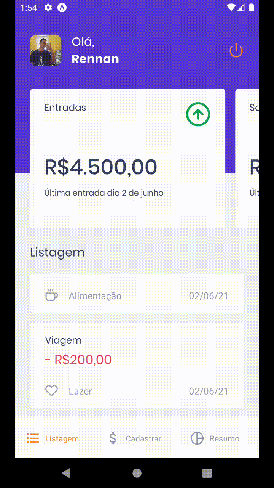

<!-- <h1 align="center" >
    
</h1> -->

<h1 align="center"> GoFinances APP 💰💜 </h1>

<h2 align="center"> 
  Take good care of your finances 🤑.
</h2>

<h3 align="center">
  This app has developed using React Native with Expo Bare Workflow.
</h3>

# Cloning this repository

```
git clone https://github.com/RennanD/gofinances-mobile.git
```

# ❗️ Requisites

For this aplication we need have installed:

- [Node](https://nodejs.org/en/)
- [Yarn](https://yarnpkg.com/lang/en/) (Optional)
- [Expo cli](https://docs.expo.io/get-started/installation/) (Optional)

### Obs.:
If you don't use expo to runing this app, install the mobile environments
SDK's, following the documentation

- [React Native Environment](https://react-native.rocketseat.dev/)

## 💻 Mobile Application

<h1 align="center">
  
</h1>

<h3 align="center">
  Now you can have full control of all your expenses and your entries in an easy way
</h3>

<p>
  In this project we use:
</p>

- [Expo With Bare Workflow](https://docs.expo.io/bare/exploring-bare-workflow/) as React Native framework.
- [Async Storage](https://react-native-async-storage.github.io/async-storage/docs/install/), for save plants in local storage.
- [styled-components](https://styled-components.com/) for styles.


### ⚡️ Start

To start application, run:

```
cd gofinances-mobile
yarn
expo start

# or

cd gofinances-mobile
npm install
expo start
```
## To run this app in a emulator/simulator

### IOS 🍎

In Expo server interface, click in `Run on iOS simulator`

### Android 👾

In Expo server interface, click in `Run on Android device/emulator`

## To run this app in a physical device

First, download Expo go in your device.
  - [Android](https://play.google.com/store/apps/details?id=host.exp.exponent&hl=pt_BR&gl=US)
  - [IOS](https://apps.apple.com/br/app/expo-go/id982107779)

After, scan QrCode in Expo server interface

## Runing without Expo 🍎👾

with the native sdks installed, let's run the following commands

### Android 👾
```
cd gofinances-mobile
yarn
yarn android

# or

cd gofinances-mobile
npm install
npm run android
```

Obs.: In linux, you must open metro bundler in a new tab

```
cd gofinances-mobile
yarn
yarn start

# or

cd gofinances-mobile
npm install
npm run start
```

### IOS 👾 (Mac user only)
```
cd gofinances-mobile
yarn
yarn ios

# or

cd gofinances-mobile
npm install
npm run start
```

# App Demo 


<h1 align="center">
  
</h1>
